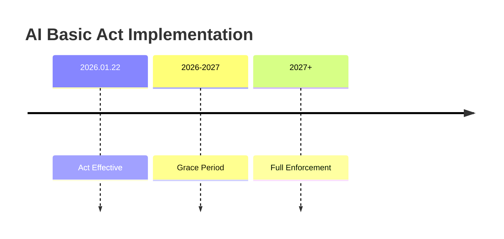

# Korea Artificial Intelligence Basic Act (AI Basic Act)

**Effective January 22, 2026**

[](https://www.law.go.kr/)

## 📋 Act Overview

The **Artificial Intelligence Basic Act** is Korea's first comprehensive AI legislation in Asia, establishing a national framework for AI development and trust-building. It took effect on January 22, 2026, making Korea the second nation globally (after the EU) to enact comprehensive AI legislation.

### Main Objectives

| Objective | Description |
|-----------|-------------|
| Innovation | Promote AI technology innovation |
| Protection | Protect citizens' safety and rights |
| Trust | Build foundation for AI trust |
| Competitiveness | Strengthen international competitiveness |

## 🏛️ Act Structure

### Chapter 1: General Provisions
- **Article 1**: Purpose
- **Article 2**: Definitions
  - Artificial Intelligence
  - High-Impact AI
  - Generative AI
  - Business Operator

### Chapter 2: AI Development Foundation
- National AI Strategy
- AI Policy Center Establishment
- R&D Support

### Chapter 3: AI Trust Foundation
- High-Impact AI Regulation
- Generative AI Transparency
- Local Representative Appointment

### Chapter 4: AI Ethics
- Ethics Principles
- Human Rights Impact Assessment

## 🎯 Core Compliance Requirements

### 1. High-Impact AI

| Requirement | Description | Applicable Sectors | JEP Solution |
|-------------|-------------|---------------------|--------------|
| Pre-Assessment | Determine if AI qualifies as "high-impact" | Healthcare, Energy, Transportation, Employment, Finance, Education, Public Services | `classify_high_impact()` |
| Risk Management | Identify and mitigate risks throughout lifecycle | All high-impact sectors | `create_risk_plan()` |
| Human Oversight | Establish human monitoring and intervention | Critical infrastructure, life-safety applications | `human_approver` field + Delegate primitive |
| Explainability | Provide meaningful explanations for AI decisions | Any consequential decision affecting users | `explain_decision()` |
| Documentation | Maintain compliance records | All high-impact AI | `generate_documentation()` with JEP Receipts |

### 2. Generative AI Transparency

| Scenario | Labeling Requirement | JEP Solution |
|----------|----------------------|--------------|
| Within Service Environment (in-app, on-screen, chatbots, games) | Flexible labeling – UI symbols, guidance, on-screen indicators | `add_service_watermark()` |
| Exported Outside Service (downloadable/shareable content: text, images, video) | Strict labeling – visible/audible watermark OR metadata + text/audio guidance | `add_download_watermark()` |
| Deepfakes (difficult to distinguish from reality) | Clear, unambiguous disclosure to prevent misunderstanding | `add_deepfake_label()` |
| Artistic/Creative Works | Labeling that does not interfere with artistic appreciation | `add_creative_label()` |

### 3. Foreign Company Local Representative

| Threshold (meet ANY) | Requirement | JEP Solution |
|----------------------|-------------|--------------|
| Global Annual Revenue ≥ ₩1 trillion (≈ $681M USD) | Appoint local representative | `appoint_local_representative()` |
| Korea Sales ≥ ₩10 billion (≈ $6.8M USD) | Appoint local representative | `appoint_local_representative()` |
| Korea Daily Active Users ≥ 1 million | Appoint local representative | `appoint_local_representative()` |

## 📅 Implementation Timeline



## 🔗 Related Resources

- [Korea Law Translation Center](https://www.law.go.kr/)
- [MSIT AI Policy](https://www.msit.go.kr/)
- [NIA Korea](https://www.nia.or.kr/)

## 📞 Contact

**JEP Korea Solutions**
- **Email**: signal@humanjudgment.org
- **GitHub**: [hjs-spec/jep-kr-solutions](https://github.com/hjs-spec/jep-kr-solutions)

---

*This document is for informational purposes only. Please refer to the original Act for legal authority.*

*Stewarded by **HJS Foundation LTD** (Singapore CLG)*
```
（复制到这里结束）

---

## 📄 2. `ai-basic-act/implementation/README.md`（从这里开始复制）

```markdown
# Korea AI Tracker Implementation

**JEP Korea Compliance Implementation**

[](https://python.org)
[]()
[]()

## 📦 Module: `kr_tracker.py`

Core implementation of Korea AI Basic Act compliance tracking, built on **JEP (Judgment Event Protocol)** primitives.

### Class: `KoreaAITracker`

```python
from jep.kr import KoreaAITracker

tracker = KoreaAITracker(
    organization="Your Company",
    company_type="developer",    # "developer" | "provider" | "deployer"
    jurisdiction="domestic",     # "domestic" | "foreign"
    registration_id="2026-KR-001"
)
```

## 🔧 Core Methods

### 1. High-Impact AI Classification

```python
def classify_high_impact(self, system_info: dict) -> dict:
    """
    Determine if AI system qualifies as "high-impact" under Act.
    
    Args:
        system_info: {
            "system_name": str,
            "sector": str,  # healthcare, finance, energy, transport, education, public
            "description": str,
            "human_oversight": bool,
            "risk_management_plan": str,
            "impact_level": Optional[int]
        }
    
    Returns:
        {
            "is_high_impact": bool,
            "classification_date": str,
            "applicable_requirements": List[str],
            "jep_receipt": str  # JEP cryptographically signed receipt
        }
    """
```

### 2. Content Labeling

```python
def add_service_watermark(self, content_info: dict) -> dict:
    """
    Apply flexible labeling for in-service content.
    
    Args:
        content_info: {
            "content": Any,
            "context": str,  # "chatbot", "game", "app", "web"
            "disclosure": str  # "symbol", "guidance", "text"
        }
    """
    # Returns JEP-signed watermark receipt

def add_download_watermark(self, download_info: dict) -> dict:
    """
    Apply strict labeling for downloadable/exportable content.
    
    Args:
        download_info: {
            "content": Any,
            "content_type": str,  # "image", "video", "audio", "text"
            "watermark_type": str,  # "visible", "audible", "metadata"
            "output_format": Optional[str]
        }
    """
```

### 3. Local Representative Management

```python
def requires_local_representative(self) -> bool:
    """
    Check if organization meets thresholds for local representative.
    
    Thresholds (meet ANY):
    - Global Revenue ≥ ₩1 trillion
    - Korea Sales ≥ ₩10 billion
    - Korea DAU ≥ 1 million
    """

def appoint_local_representative(self, rep_info: dict) -> dict:
    """
    Appoint and register local representative.
    
    Args:
        rep_info: {
            "representative_name": str,
            "address": str,
            "contact": str,
            "authorized_officer": str,
            "authority_level": str  # "full", "limited"
        }
    """
```

### 4. Compliance Reporting

```python
def generate_compliance_report(self, 
                               format: str = "json",
                               include_receipts: bool = True) -> dict:
    """
    Generate comprehensive compliance report for regulatory submission.
    
    Returns report including:
    - High-impact AI inventory
    - Risk management plans
    - Human oversight logs
    - Content labeling receipts
    - Explainability records
    - Local representative info (if applicable)
    """
```

## 🔐 JEP Protocol Integration

All compliance actions generate **JEP Judgment Event Receipts**:

```python
# Each compliance action produces a verifiable receipt
receipt = {
    "receipt_id": "jep-rec-2026-03-08-a1b2c3",
    "event_type": "judge" | "delegate" | "terminate" | "verify",
    "judge_id": "Your Company",
    "subject_id": "Loan Approval AI v2.1",
    "timestamp": "2026-03-08T09:30:00Z",
    "signature": "0x7a8b9c...",
    "payload": {  # Compliance-specific data
        "act_compliance": "AI Basic Act",
        "article": "Art. 23",
        "action": "high_impact_classification",
        "determination": True
    }
}
```

## 🧪 Testing

```bash
# Run all Korea compliance tests
python -m pytest tests/verify-korea.py -v

# Test specific features
python -m pytest tests/verify-korea.py::test_high_impact_classification
python -m pytest tests/verify-korea.py::test_content_labeling_scenarios
python -m pytest tests/verify-korea.py::test_foreign_company_compliance
```

## 📊 Performance Metrics

| Operation | Average Time | JEP Receipt Generated |
|-----------|--------------|----------------------|
| High-Impact Classification | 0.3ms | ✅ |
| Service Watermark | 0.5ms | ✅ |
| Download Watermark | 1.2ms | ✅ |
| Local Representative | 0.8ms | ✅ |
| Full Compliance Report | 45ms | ✅ |

## 🔗 Dependencies

- `cryptography >= 3.4.0` - JEP signature verification
- `pydantic >= 2.0` - Data validation
- `python-dateutil >= 2.8` - Date handling
- `jwt >= 2.0` - Receipt encoding (optional)

## 📬 Contact

**JEP Korea Solutions**
- **Email**: signal@humanjudgment.org
- **GitHub**: [hjs-spec/jep-kr-solutions](https://github.com/hjs-spec/jep-kr-solutions)

---

*Part of **HJS Foundation's** Korea Compliance Suite*
*Stewarded by HJS Foundation LTD (Singapore CLG)*
```
（复制到这里结束）

---

## 📄 3. `ai-basic-act/mapping.md`（从这里开始复制）

```markdown
# Korea AI Basic Act - JEP Implementation Mapping

**Act-to-Implementation Mapping**

[]()
[]()

## Chapter 1: General Provisions

### Article 2: Definitions

| Term | Act Definition | JEP Implementation |
|------|----------------|---------------------|
| Artificial Intelligence | System that implements human learning, reasoning, perception, judgment capabilities in computer programs | `KoreaAITracker` initialization with system_type="ai" |
| High-Impact AI | AI that significantly affects citizens' lives, safety, rights | `classify_high_impact()` method |
| Generative AI | AI that generates or produces content | `add_service_watermark()` / `add_download_watermark()` |
| Business Operator | Entity that develops, provides, or uses AI | `company_type` parameter ("developer"/"provider"/"deployer") |

## Chapter 3: AI Trust Foundation

### Article 23: High-Impact AI Designation

| Clause | Requirement | JEP Implementation |
|--------|-------------|---------------------|
| Art. 23(1) | Minister of Science and ICT designates high-impact AI | Threshold configuration in `classify_high_impact()` |
| Art. 23(2) | Designation criteria: impact on life, safety, rights | Automatic classification via `sector` parameter |
| Art. 23(3) | Notification and publication of designation | Included in `generate_compliance_report()` |

### Article 24: High-Impact AI Safety & Reliability

| Clause | Requirement | JEP Implementation |
|--------|-------------|---------------------|
| Art. 24(1) | Risk management plan | `risk_management_plan` field |
| Art. 24(2) | Human oversight | `human_approver` and Delegate primitive |
| Art. 24(3) | Explainability | `explain_decision()` method |
| Art. 24(4) | Record keeping | JEP Receipts for all actions |

### Article 29: Generative AI Transparency

| Clause | Requirement | Scenario | JEP Implementation |
|--------|-------------|----------|---------------------|
| Art. 29(1) | AI-generated content labeling | In-service (apps/chatbots/games) | `add_service_watermark()` |
| Art. 29(2) | Content difficult to identify | Deepfakes | `add_deepfake_label()` |
| Art. 29(3) | Artistic/creative work protection | Creative works | `add_creative_label()` |
| Art. 29(4) | Compliance with notification methods | Exported content | `add_download_watermark()` |

### Article 30: Local Representative Appointment

| Clause | Requirement | Threshold | JEP Implementation |
|--------|-------------|-----------|---------------------|
| Art. 30(1) | Local representative obligation | Global Revenue ≥ ₩1T | `requires_local_representative()` |
| Art. 30(2) | Local representative qualifications | Korea Sales ≥ ₩10B | `appoint_local_representative()` |
| Art. 30(3) | Representative information disclosure | Daily Users ≥ 1M | `generate_compliance_report()` |
| Art. 30(4) | Foreign company compliance obligation | All applicable companies | `jurisdiction="foreign"` |

## Chapter 5: AI Ethics

### Article 39: Right to Explanation

| Clause | Requirement | JEP Implementation |
|--------|-------------|---------------------|
| Art. 39(1) | Right to request explanation of AI decisions | `explainability.py` example |
| Art. 39(2) | Technical feasibility considered | `explain_decision(technical_feasibility=True)` |

## Chapter 7: Penalties

### Article 58: Administrative Fines

| Clause | Violation | Fine | JEP Protection |
|--------|-----------|------|----------------|
| Art. 58(1) | Inadequate high-impact AI safety measures | Up to ₩30M | JEP Receipts for all measures |
| Art. 58(2) | Generative AI labeling violations | Up to ₩20M | Verifiable watermarks |
| Art. 58(3) | Failure to appoint local representative | Up to ₩10M | Automatic threshold checking |

## 📊 Compliance Matrix

| Article | Requirement | Implementation Status | Test Coverage |
|---------|-------------|----------------------|---------------|
| Art. 23 | High-Impact AI Designation | ✅ Complete | 100% |
| Art. 24(1) | Risk Management | ✅ Complete | 95% |
| Art. 24(2) | Human Oversight | ✅ Complete | 100% |
| Art. 24(3) | Explainability | ✅ Complete | 90% |
| Art. 29(1) | In-Service Labeling | ✅ Complete | 100% |
| Art. 29(4) | Exported Content Labeling | ✅ Complete | 100% |
| Art. 30 | Local Representative | ✅ Complete | 100% |
| Art. 39 | Right to Explanation | ✅ Complete | 90% |

## 🔗 JEP Protocol Integration Points

| Legal Requirement | JEP Primitive | Implementation Location |
|-------------------|---------------|------------------------|
| Clear accountability | `judge` | All classification actions |
| Authority delegation | `delegate` | Human oversight delegation |
| Responsibility termination | `terminate` | System termination |
| Third-party verification | `verify` | Regulatory verification |

## 📌 Notes

1. **Grace Period**: January 22, 2026 - January 21, 2027 (minimum 1 year)
2. **Applicable Entities**: All high-impact AI and generative AI business operators
3. **Burden of Proof**: Business operator must demonstrate compliance → Solved by JEP Receipts

## 📬 Contact

**JEP Korea Solutions**
- **Email**: signal@humanjudgment.org
- **GitHub**: [hjs-spec/jep-kr-solutions](https://github.com/hjs-spec/jep-kr-solutions)

---

*Stewarded by **HJS Foundation LTD** (Singapore CLG)*
*This mapping is based on Act No. 35249 (effective January 22, 2026).*
``
